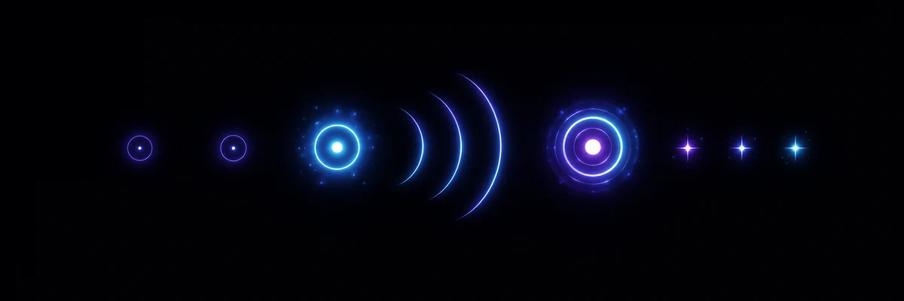

<div align="center">

# ◉ IMPULSE

### ОДНО КАСАНИЕ · ОДИН ИМПУЛЬС · МАКСИМАЛЬНАЯ ЦЕПЬ



[](https://github.com/StanleyLl0yd/impulse/actions/workflows/ci.yml)
[](https://github.com/StanleyLl0yd/impulse/releases/latest)
[](https://github.com/StanleyLl0yd/impulse/releases)
[](https://github.com/StanleyLl0yd/impulse)
[](https://github.com/StanleyLl0yd/impulse)
[](LICENSE)

[](README.md)
[](README_RU.md)

Минималистичная Android-игра о цепных реакциях, управляемая одним касанием.

</div>

Частицы движутся по почти чёрному полю. У игрока есть одно касание. Оно создаёт расширяющийся импульс; каждая задетая частица может породить новую волну, а новая волна — продолжить реакцию. Вся попытка решается одним выбранным моментом.

Текущая версия исходного кода: **0.5.0** (`versionCode 6`) · Min SDK: **26 (Android 8.0)** · Target SDK: **37**

## ⚡ Идея

1. Наблюдать за движением частиц.
2. Один раз коснуться экрана и разместить единственный импульс игрока.
3. Дождаться, пока волна расширится и активирует соседние частицы.
4. Активированные частицы создают собственные волны.
5. Достичь цели до затухания реакции — или мгновенно начать новую попытку.
6. Проходить уровни, улучшать счёт и получать до трёх звёзд на каждом уровне.

Текущая кампания содержит **20 детерминированных уровней** с постепенно растущим количеством частиц и целями прохождения.

> Одно касание. Один импульс. Максимальная цепь.

## ✨ Что уже работает

- Управление одним касанием и один импульс на попытку
- 20 data-driven детерминированных уровней с возрастающими целями
- Пятисекундный фирменный splash IMPULSE с переходом в отдельное главное меню
- Главное меню: Продолжить, Новая игра, Достижения, Об игре и Выход
- Продолжить открывает максимально доступный уровень; Новая игра начинает с уровня 1 без удаления прогресса
- Экран достижений с максимально доступным уровнем и общим количеством заработанных звёзд
- Разблокировка уровней, переход на следующий уровень и компактный выбор кампании
- Счёт за уровень, оценка 1–3 звезды, сохранение рекорда и общий прогресс по звёздам
- Локальное сохранение прогресса, выбранного уровня, лучших результатов и настроек Game Feel через AndroidX DataStore
- Движущиеся частицы с отражением от границ поля
- Расширяющиеся волны игрока и цепной реакции
- Учёт глубины цепи и количества активированных частиц
- Мгновенный детерминированный повтор того же уровня
- Независимая от частоты кадров fixed-step симуляция
- Многослойные неоновые волны, следы, вспышки активации, pulse-эффекты и визуальная реакция на глубину цепи
- Звуковая и тактильная обратная связь для касания, активаций цепи, победы и поражения
- Сохраняемые переключатели звука, вибрации и уменьшенных эффектов
- Отдельное сообщение для near miss и UX результата/повтора/следующего уровня
- Русские и английские ресурсы интерфейса
- Портретная Android-ориентация
- Без аккаунта, backend, аналитики, рекламы и разрешения на доступ в интернет

Текущая сборка образует полноценный локальный игровой цикл: **открыть главное меню, продолжить с максимально доступного уровня или начать заново с уровня 1, сделать один импульс, получить результат, сохранить прогресс и перейти дальше либо улучшить тот же детерминированный уровень.**

## 🎮 Ощущение игры

IMPULSE строится на ясности и нарастании реакции, а не на визуальном шуме:

- **запуск** — приложение начинается с абсолютного чёрного экрана, за пять секунд проявляет изображение IMPULSE и открывает главное меню;
- **меню** — Продолжить открывает максимально доступный уровень, а Новая игра начинает с уровня 1 без очистки прогресса;
- **кампания** — разблокированные уровни показывают лучший результат в звёздах, а игра считает общий прогресс;
- **ожидание** — холодные голубые частицы спокойно движутся по полю;
- **касание** — из выбранной точки расходится один голубой импульс;
- **цепь** — активированные частицы становятся фиолетово-пурпурными и создают новые волны;
- **результат** — счёт, звёзды, победа, поражение и почти успешная попытка быстро завершаются, поэтому повтор или следующий уровень всегда рядом.

Симуляция детерминирована и поддерживает seed, поэтому каждый уровень можно воспроизводить на разных устройствах, при повторных попытках и в тестах, при этом рендеринг может работать с частотой обновления экрана.

## 📦 Доступность

Актуальная публичная версия **IMPULSE 0.5.0** доступна в [GitHub Releases](https://github.com/StanleyLl0yd/impulse/releases/tag/v0.5.0): публикуются подписанные APK и AAB, а также SHA-256 checksums.

Репозиторий открыт для просмотра в целях прозрачности проекта и ознакомления. **Публичная доступность не даёт разрешения копировать, собирать, изменять, запускать, распространять или иным образом использовать исходный код и материалы проекта.** См. [LICENSE](LICENSE).

Для публичной сборки требуется Android 8.0 или новее.

## 🛠️ Разработка

Следующие команды предназначены только для правообладателя и явно уполномоченной разработки. Они не предоставляют лицензию третьим лицам.

Требования:

- JDK 17
- Android SDK 37
- Gradle 9.7.1 через Gradle Wrapper из репозитория

Сборка debug-приложения из разрешённой рабочей копии:

```bash
./gradlew assembleDebug
```

Основная локальная проверка:

```bash
./gradlew testDebugUnitTest lintDebug assembleDebug
```

Windows:

```powershell
.\gradlew.bat testDebugUnitTest lintDebug assembleDebug
```

## 🧱 Технологии

| Категория | Технология |
| --- | --- |
| Язык | Kotlin 2.4.10 |
| UI | Jetpack Compose + Material 3 |
| Рендеринг | Compose Canvas |
| Симуляция | Собственный детерминированный fixed-step 2D-движок |
| Хранение | AndroidX DataStore Preferences 1.2.1 |
| Сборка | Gradle 9.7.1, AGP 9.3.2, Kotlin DSL |
| Android | minSdk 26, targetSdk 37, compileSdk 37 |
| Application ID / namespace | `com.sl.impulse` |

Игровая симуляция по-прежнему отделена от рендеринга, а прогресс кампании и настройки сохраняются локально вне игрового движка.

## ✅ Проверки качества и безопасности

Pull request и push в `main` автоматически проходят:

- unit tests;
- Android Lint;
- сборку debug и release APK/AAB;
- компиляцию Android instrumentation tests;
- runtime instrumentation tests на API 37;
- еженедельный runtime-прогон на минимальном API 26;
- CodeQL для Java/Kotlin;
- Semgrep с security- и secret-rules;
- Gitleaks по полной истории Git;
- Qodana по расписанию и вручную.

Сторонние GitHub Actions закреплены по неизменяемым commit SHA, workflow используют минимально необходимые permissions, а защищённый `main` требует успешные `Verify`, `Analyze Java and Kotlin`, `Semgrep` и `Gitleaks` перед squash merge.

Об уязвимостях следует сообщать по правилам из [SECURITY.md](SECURITY.md).

## 🔐 Целостность релизов

Официальные релизы запускаются тегами `vMAJOR.MINOR.PATCH`, которые должны совпадать с `versionName`.

Android Release workflow:

1. проверяет тег, версию исходного кода, `versionCode` и успешность обязательных проверок для помеченного тегом commit в `main`;
2. запускает тесты и Android Lint;
3. восстанавливает предоставленный владельцем ключ подписи только внутри защищённого environment `release`;
4. собирает подписанные APK и AAB;
5. проверяет APK Signature Schemes v2/v3, количество подписантов и ожидаемый SHA-256 сертификата для APK и AAB;
6. создаёт SHA-256 checksums;
7. создаёт GitHub artifact attestations для APK и AAB;
8. публикует GitHub Release только после успешной проверки.

Keystore и пароли подписи никогда не хранятся в репозитории. Подробности: [docs/RELEASE.md](docs/RELEASE.md).

## 🔒 Приватность

- **Offline по умолчанию** — приложение не запрашивает Android-разрешение `INTERNET`
- **Без аккаунта, аналитики, tracking и рекламы**
- Прогресс и настройки хранятся только локально через DataStore
- Без backend и обязательной облачной инфраструктуры
- В текущем объёме нет опасных Android runtime permissions

Это намеренная граница проекта, которая остаётся базовой, пока у будущей функции не появится конкретная причина её изменить.

## 🌍 Языки

- English — язык по умолчанию
- Русский

Интерфейс следует языку устройства через Android resources.

## 🗺 План развития

- **Сейчас:** детерминированная кампания из 20 уровней, главное меню с продолжением/новой игрой, сводка достижений, разблокировка, scoring, звёзды, локальное сохранение, отполированный визуальный/звуковой/тактильный Game Feel и пятисекундный кинематографичный запуск
- **Далее:** балансировка уровней, tutorial/onboarding, accessibility pass и более подробная локальная статистика
- **Контент:** расширение примерно до 60 подготовленных/генерируемых уровней для первой полноценной версии
- **Позже:** endless mode и daily challenge после проверки основного цикла кампании

Направление проекта подробно описано в [PROJECT.md](PROJECT.md).

## 📊 История изменений

- [CHANGELOG.md](CHANGELOG.md)
- [GitHub Releases](https://github.com/StanleyLl0yd/impulse/releases)

## 🤝 Обратная связь и участие

Сообщения об ошибках и предложения приветствуются.

Исходный код, графика, документация и другие материалы принимаются только по предварительному явному согласованию с правообладателем. Отправка материалов не предоставляет лицензию на IMPULSE и не изменяет принадлежность прав на проект. Правила проекта находятся в [AGENTS.md](AGENTS.md).

## 📄 Лицензия

**IMPULSE является проприетарным программным обеспечением. Copyright © 2026 Stanley Lloyd. Все права защищены.**

Все оригинальные исходные коды, графика, документация, игровой дизайн и другие оригинальные материалы проекта принадлежат Stanley Lloyd. Не предоставляется разрешение копировать, изменять, собирать, запускать, распространять, публиковать, сублицензировать, продавать, создавать производные работы или иным образом использовать любую часть проекта, кроме случаев, прямо требуемых применимым законодательством, условиями платформы GitHub или предварительным письменным разрешением правообладателя.

Сторонние зависимости сохраняют собственные лицензии. Полные условия: [LICENSE](LICENSE).

## 👨‍💻 Автор

**Stanley Lloyd** · [@StanleyLl0yd](https://github.com/StanleyLl0yd)

---

<div align="center">

**ОДНО КАСАНИЕ · ОДИН ИМПУЛЬС · МАКСИМАЛЬНАЯ ЦЕПЬ**

</div>